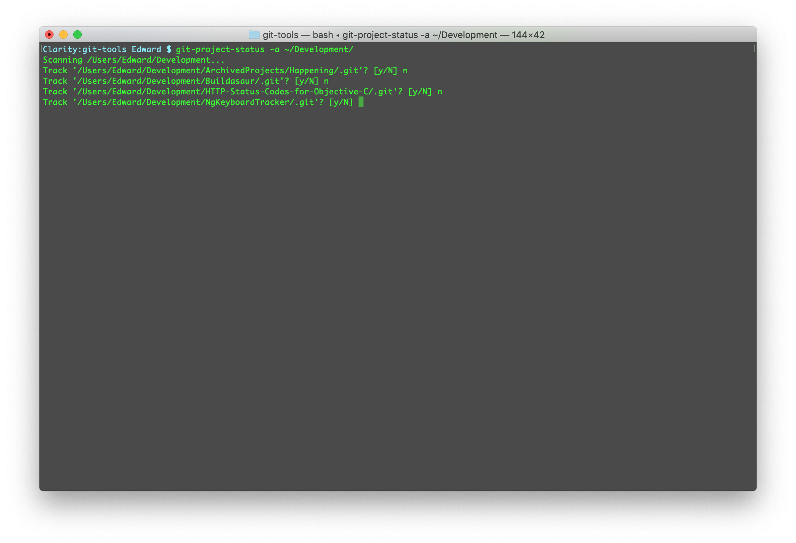
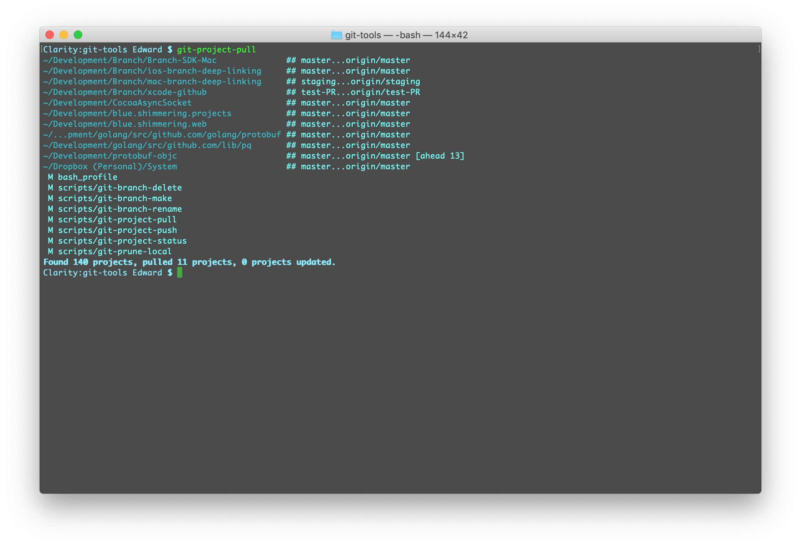
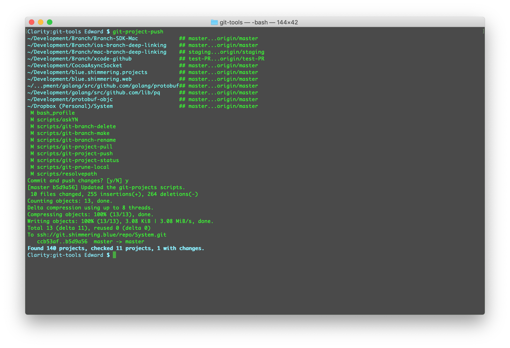
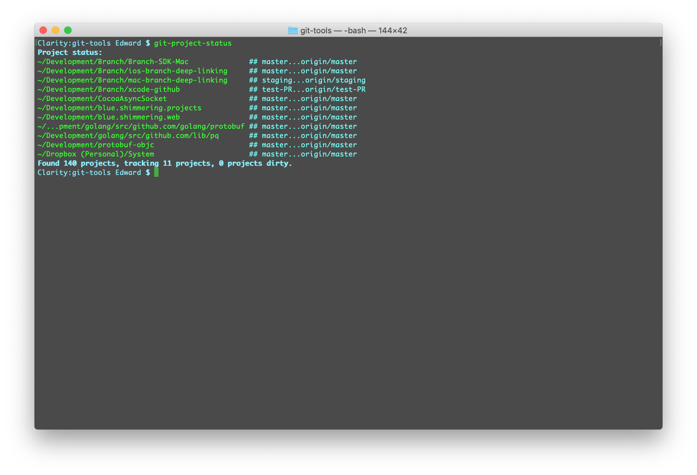

[](https://raw.githubusercontent.com/hyperium/hyper/master/LICENSE)

<h1>
git-tools
<span style="position:relative;top:-0.5em;float:right">

</span>
</h1>
<br>

Here are some handy command line scripts I frequently use when working with git.


## Simple Scripts

These are short scripts I use to simplify frequent git tasks.

Install these scripts by adding this repo to your `PATH` variable in your `~/.bash_profile`
config file (for login shells) or your `~/.bashrc` config file (for non-login shells).

So... should you add this line to your `.bash_profile` or your `.bashrc` file?
Here's a write up about
[.bash_profile vs .bashrc.](http://www.joshstaiger.org/archives/2005/07/bash_profile_vs.html)
that explains the difference between the two.

The line in your config file should look like this:

```
PATH=<repo-install-path>/git-tools:"$PATH"
```

Mine looks like:

```
PATH=/Users/Edward/Development/git-tools:"$PATH"
```

### Scripts

| Script                | Description |
|:----------------------|:------------|
| git-branch-delete     | Deletes a local and remote branch. |
| git-branch-make       | Creates a local branch and pushes it to the remote. |
| git-branch-rename     | Renames a local and remote branch. |
| git-completion.bash   | A git completion script for bash/zsh. The installation instructions are in the comments in the header of the file. |
| git-graph             | Outputs a nifty graph of the project branch history. |
| git-prune-local       | Prunes your local repo of merged and deleted branches. |
| askYN                 | A helper script that asks yes / no question on the command line. |
| resolvepath           | A helper script that returns the full path of a passed partial path. |

<br>

## Git Project Scripts

I tend to work on a number of projects at once during the day. For instance I might change some server code, tweak a micro-service, and then update an iOS app to be compatible with these changes.

At the beginning of the day I like to pull all the new changes to the projects from other
team members and at night push all my changes upstream. It's handy update all my projects
with a single command.

I wrote some git project scripts to help with this work flow.

### Scripts

| Script                | Description |
|:----------------------|:------------|
| git-project-pull      | Pull all projects in your ~/.git-projects file from their remotes. |
| git-project-push      | Push all dirty projects in your ~/.git-projects file to their remotes. |
| git-project-status    | Displays the status of your projects. Alternately adds projects to track. |

Each of these scripts supports the `-h` help option that shows usage details.

### Usage

Start by adding the projects you want to track by using the `git-project-status -a`
command. You can add your git projects one by one from the command line:

```
git-project-status -a project1/ project2/
```

or have `git-project-status` scan a directory for projects, like this:



Be patient: scanning a directory for git projects may take some time.

You only need to add your projects once.  The projects that are tracked are saved in a
config file called `~/.git-projects`. You can add or remove projects by editing this file
or re-running the `git-project-status -a` command.

### Daily Tasks

#### git-project-pull

Pull updates to your projects from the remote using the `git-project-pull` command:



#### git-project-push

Push your updates to the remote with the `git-project-push` command:



#### git-project-status

You can check the status of your projects without updating anything by using the `git-project-status` command used without the `-a` option:



#### Tips

Typing `git-project-pull` all the time is a lot of typing so I added some aliases to my
`.bashrc` file to shorten it up:

```
alias gps=git-project-status
alias gpp=git-project-push
alias gpu=git-project-pull
```
